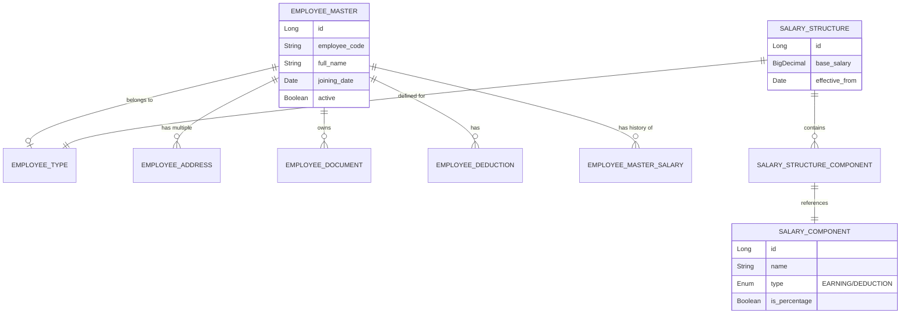

# Employee Module Technical Documentation

## Overview
The Employee Module is a core component of the School Management System (SMS) designed to manage the full lifecycle of employees within the institute. It handles everything from personal data and organizational placement to complex salary structures and payroll processing.

## Architecture & Data Model

### Entity Relationship Diagram

## Core Components

### 1. Employee Management
- **Master Data**: Managed via `EmployeeMasterController`. Stores personal info (CNIC, DOB, Gender), contact info, and employment status.
- **Organization Hierarchy**: Employees are linked to Departments and Designations. History is tracked automatically whenever these change.
- **Lifecycle tracking**: Supports active/inactive status and probation tracking.

### 2. Salary & Payroll System
The module uses a template-based salary system where structures are defined per employee type.

- **Salary Structure**: A blueprint for salary calculation. It includes a `base_salary` and multiple components.
- **Salary Components**: Can be either `EARNINGS` (e.g., HRA, Bonus) or `DEDUCTIONS` (e.g., Tax, PF). Components can be fixed amounts or percentages of the base salary.
- **Calculation Logic**: 
    - `Gross Salary = Base Salary + Sum(Earnings)`
    - `Net Salary = Gross Salary - Sum(Deductions)`

### 3. Document & Media Management
- **Profile Photos**: Handled via `UploadUtil` and stored in a configurable directory.
- **Documents**: Employees can have multiple documents (IDs, Certificates) uploaded with specific keys and metadata.

## API Reference (Key Endpoints)

| Method | Endpoint | Description |
| :--- | :--- | :--- |
| `GET` | `/api/institute/employees/list` | Returns all active employees. |
| `GET` | `/api/institute/employees/{id}` | Fetches detailed employee profile. |
| `POST` | `/api/institute/employees/update-profile-photo` | Uploads/Updates employee photo. |
| `POST` | `/api/institute/employees/upload-document` | Uploads specialized documents. |
| `GET` | `/api/institute/employees/{id}/addresses` | Lists all addresses for an employee. |
| `GET` | `/api/institute/employees/salary/detail/{empId}` | Generates a real-time salary breakdown based on structure. |

## Key Business Logic
### History Tracking
The system maintains historical records for:
- **Department Changes**: `EmployeeDepartmentHistoryEntity`
- **Designation Changes**: `EmployeeDesignationHistoryEntity`
- **Type Changes**: `EmployeeTypeHistoryEntity`

Each history record has an `isCurrent` flag to easily identify the active state while preserving the audit trail.

---
> [!NOTE]
> This module is integrated with the `System User` module via a 1:1 relationship, allowing employees to have login credentials for the portal.
